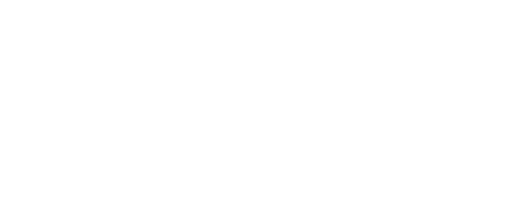
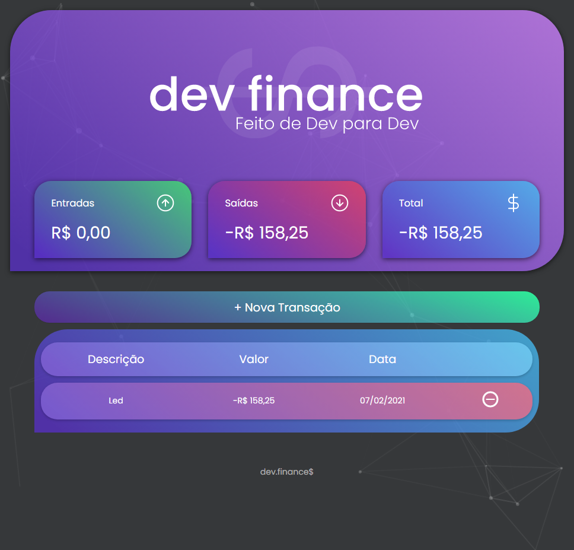

<h4 align="center">
    
    <br/>
    Gerencia suas finanças
    <br>
</h4>

<p align="center">
  <br>
  

  <a href="https://rocketseat.com.br">
    
  </a>

  <a href="https://github.com/LMThomaz/devFinance/commits/master">
    
  </a>

  
</p>

---

## :mag: Sobre o projeto

Feito de desenvolvedor para desenvolvedor, sistema para seu controle financeiro :computer::dollar:  
Desenvolvido durante a Maratona Discover, oferecida pela [Rocketseat :rocket:][url-rocketseat]  
A maratona detêm o conteúdo prático de todo os cursos oferecidos na plataforma de forma gratuíta, também oferecendo desáfios, insights, hacks e uma explicação concisa :coffee:

---

## :art: O protótipo?

O layout da aplicação está disponível no [Figma][url-figma]


---

## :hammer: Tecnologias?

Utilizando a tríade base da web:

- HTML
- CSS
- JavaScript

---

## :electric_plug: Como usar?

É **necessário** que tenha instalado em sua máquina:

- [Git][url-git]
- Editor de texto (recomendação: [VSCode][url-vs])

## :package: Como clonar a aplicação?

```bash
# Clonar o repositório
$ git clone https://github.com/LMThomaz/devFinance
```

## :coffee: Como posso ajudar?

1. Faça o Fork deste repositório
2. Comece uma branch com sua feature

```bash
$ git checkout -b minha-feature
```

3. Confirme (Commit) seus feitos

```bash
$ git commit -m 'Minha nova feature'
```

4. Suba (push) sua branch

```bash
$ git push origin minha-feature
```

## :mortar_board: Quem ministrou ?

As aulas foram ministradas pelo [Mayk Brito][mayk], durante as aulas da **Maratona Discover** :rocket:

## :page_with_curl: Licença

O projeto está utilizando a licença MIT. Confira [LICENSE][license] para mais detalhes.

---

<h4 align="center">
Feito com 💜 por <a href="https://www.linkedin.com/in/leonardo-thomaz/" target="_blank">Leonardo Thomaz</a>
</h4>

[url-figma]: https://www.figma.com/file/vBNDmSI71wooNPWbL5uc6L/dev.finance-Maratona-Discover?node-id=0%3A1/
[url-rocketseat]: https://rocketseat.com.br/
[url-git]: https://git-scm.com/
[url-vs]: https://code.visualstudio.com/
[url-npm]: https://www.npmjs.com/
[url-yarn]: https://yarnpkg.com/
[mayk]: https://github.com/maykbrito
[license]: https://github.com/LMThomaz/devFinance/blob/master/LICENSE.md
